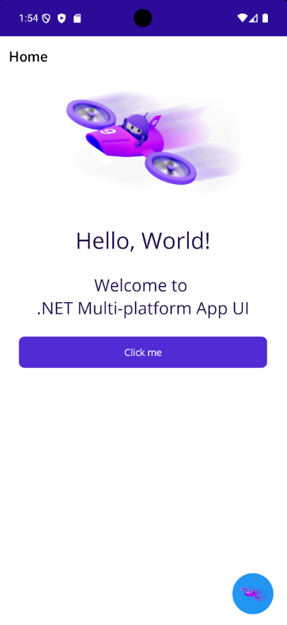

# FloatingChatButton for .NET MAUI

[](https://www.nuget.org/packages/Shaunebu.MAUI.Controls.FloatingChatButton/)
[](https://www.nuget.org/packages/Shaunebu.MAUI.Controls.FloatingChatButton/)


A customizable floating chat button component for .NET MAUI applications. It provides a draggable collapsed button, edge snapping, expand/collapse animations, bindable properties, and a built-in local chat panel.

## Installation

```bash
dotnet add package Shaunebu.MAUI.Controls.FloatingChatButton
```

Register the package in `MauiProgram.cs`:

```csharp
using FloatingChatButton;

builder
    .UseMauiApp<App>()
    .UseFloatingChatButton();
```

## Features

* **Drag-and-drop** with edge snapping behavior.
* **Expand/collapse** animations using MAUI animations.
* **Bindable properties** for MVVM-friendly expanded state, primary color, icon, and messages.
* **Built-in chat UI** with incoming and outgoing message bubbles.
* **Android and iOS targets** for .NET 9 and .NET 10 MAUI.
* **Accessible defaults** for the floating button, input, and send action.

## Basic Usage

Use the registered XAML namespace in a page:

```xml
<?xml version="1.0" encoding="utf-8" ?>
<ContentPage
    x:Class="MyApp.ChatPage"
    xmlns="http://schemas.microsoft.com/dotnet/2021/maui"
    xmlns:x="http://schemas.microsoft.com/winfx/2009/xaml"
    xmlns:fc="http://schemas.shaunebu.com/maui/controls">

<Grid>
    <ScrollView>
        <!-- Page content -->
    </ScrollView>

    <fc:FloatingChatButton
        IsExpanded="{Binding IsChatOpen, Mode=TwoWay}"
        Messages="{Binding Messages}"
        PrimaryColor="#2196F3"
        BotIcon="chat_icon.png" />
</Grid>

</ContentPage>
```

Use an observable message collection in your view model:

```csharp
using FloatingChatButton.Models;
using System.Collections.ObjectModel;

public ObservableCollection<ChatMessage> Messages { get; } =
[
    new ChatMessage { Text = "Welcome!", IsIncoming = true },
    new ChatMessage { Text = "How can I help?", IsIncoming = true }
];
```

## Core Properties

| Property | Type | Description | Default |
| --- | --- | --- | --- |
| `PrimaryColor` | `Color` | Button color while collapsed | `Colors.Blue` |
| `Messages` | `ObservableCollection<ChatMessage>` | Chat messages displayed by the panel | Per-instance empty collection |
| `IsExpanded` | `bool` | Expanded state, suitable for two-way binding | `false` |
| `BotIcon` | `ImageSource` | Icon displayed while collapsed | `dotnet_bot` file image |

## Message Model

| Property | Type | Description |
| --- | --- | --- |
| `Text` | `string` | Message text. Defaults to an empty string. |
| `IsIncoming` | `bool` | `true` for incoming alignment/style, `false` for outgoing alignment/style. |

## Customization

```xml
<fc:FloatingChatButton
    PrimaryColor="#4CAF50"
    BotIcon="support_chat.png"
    Messages="{Binding Messages}" />
```

```csharp
using FloatingChatButton.Models;

static void AddLocalMessage(global::FloatingChatButton.Controls.FloatingChatButton floatingChatButton)
{
    floatingChatButton.IsExpanded = true;
    floatingChatButton.Messages.Add(new ChatMessage
    {
        Text = "New local message",
        IsIncoming = false
    });
}
```

## Screenshots

<div align="center">
  
</div>

## Accessibility

The control sets default semantic descriptions and hints for the collapsed button, chat input, and send button. Consumers can override semantics in XAML or code when app-specific wording is needed. The collapsed button is 60x60 device-independent units by default, meeting the common minimum touch target size.

## Lifecycle and Threading

`Messages` is a consumer-owned `ObservableCollection<ChatMessage>`. Each control instance receives its own default collection. Replacing the collection is supported; the control unsubscribes from the previous collection and observes the replacement while loaded. Assigning `null` is coerced to a new empty collection.

Change the collection on the UI thread, or dispatch changes to the UI thread before mutating it. Collection changes while the control is unloaded do not trigger auto-scroll.

The control aborts its owned animations when unloaded, when the handler changes, and when disposed. Consumers normally do not need to call `Dispose()` when MAUI owns the visual tree; it is available for advanced hosts that manually create and tear down controls. After disposal, the control should not be reused.

If expand/collapse requests overlap, the latest requested state wins and older transition completions are ignored. The control does not send chat content to logs, telemetry, or external services.

## Layout Notes

Place the control in a layout that fills the visible page, commonly as the last child of a root `Grid`. The button uses MAUI device-independent layout coordinates, clamps drag movement to its allocated bounds, and re-clamps itself after page size changes.

## Demo Runtime Harness

The main repository includes `FloatingChatButton.Demo`, a MAUI app with scenarios for expand/collapse, rapid transitions, dragging and snapping, keyboard send flow, programmatic messages, collection replacement, multiple instances, navigation lifecycle, theme changes, accessibility text, small containers, long message lists, disposal, memory navigation loops, and orientation resizing.

## Validation Notes

Automated unit tests cover message collection subscription behavior, layout clamping, snap calculations, expanded dimensions, transition coordination, converter behavior, model defaults, registration validation, and the public API baseline.

Detailed Android and iOS runtime checklists are maintained in `docs/testing/android-validation.md` and `docs/testing/ios-validation.md`.

## Troubleshooting

**Missing icons**

Ensure image assets are included in the consuming MAUI app's `Resources/Images/` folder or platform-specific image resource folders.

**Messages are not updating**

Use an `ObservableCollection<ChatMessage>` and mutate it on the UI thread:

```csharp
Messages.Add(new ChatMessage { Text = "Hello", IsIncoming = true });
```

**The button snaps within the wrong area**

Place the control in a root overlay layout instead of inside a `ScrollView`.

## Resources

* [Repository](https://github.com/Shaunebu/Shaunebu.MAUI.FloatingChatButton)
* [NuGet](https://www.nuget.org/packages/Shaunebu.MAUI.Controls.FloatingChatButton/)
* [Issues](https://github.com/Shaunebu/Shaunebu.MAUI.FloatingChatButton/issues)
* [Discussions](https://github.com/Shaunebu/Shaunebu.MAUI.FloatingChatButton/discussions)

## Support

Report issues through GitHub or contact [jorge.p@shaunebu.com](mailto:jorge.p@shaunebu.com).

## License

MIT License © 2025–2026 Shaunebu. All rights reserved. See [LICENSE](../LICENSE) for details.
